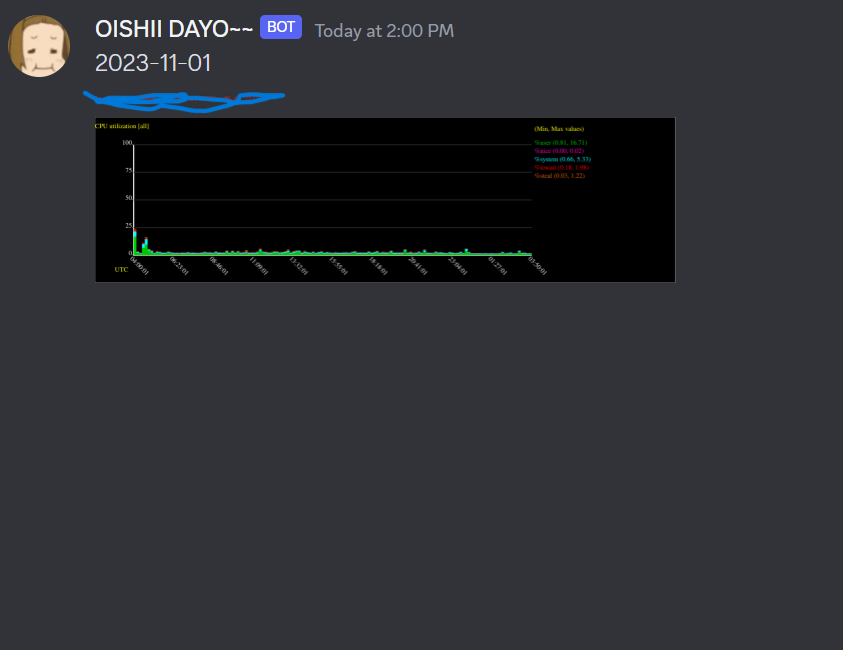

# Sysstat_Webhook

currently, WIP. But yeah, Discord sucks! They don't rendering SVG.
# Required Package
```
sudo apt install -y librsvg2-bin
```

# Arguments
```
        w) webhook_url=${OPTARG};;    # Discord Webhook URL
        c) CPU="True";;               # CPU
        r) RAM="True";;               # RAM
        d) DISK_IO="True";;           # DISK I/O
        n) NETWORK="True";;           # Network
        t) MESSAGE_TEXT=${OPTARG};;   # Add some text to your webhook message!
        f) datafile=${OPTARG};;       # where your data belongs!
        o) SYSSTAT_OPTIONS=${OPTARG};; # Sysstat options  
```

# Basic running
```
curl -sL https://github.com/minoplhy/scriptbox/raw/main/sysstat_webhook/stat_discord.sh | bash -s -- -w <WEBHOOK_URL> ARGUMENTS GOES HERE!
```

# Sample usage

This will get stats from previous day , and the webhook message will be yesterday date.

something like this :



```
text=$(date -d '-1 day' '+%Y-%m-%d')
d1=$(date -d '-1 day' '+%d')
file=/var/log/sysstat/sa$d1

curl -sL https://github.com/minoplhy/scriptbox/raw/main/sysstat_webhook/stat_discord.sh | bash -s -- -w <WEBHOOK_URL> -c -f "$file" -t "$text
```