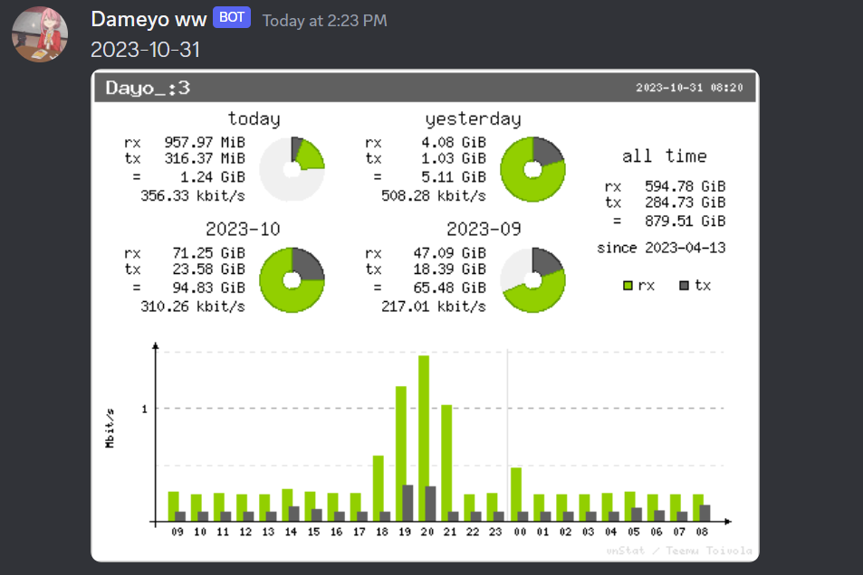

# VNSTATI webhook

A simple and maybe effective script to generate vnstati graph and send it to your discord via webhook!

# How to run?
```
curl -sL https://github.com/minoplhy/scriptbox/raw/main/vnstati_webhook/sti_discord.sh | bash -s -- -w WEBHOOK_URL ARGUMENTS GOES HERE!
```

## Arguments

`-w` DISCORD_WEBHOOK_URL

`-s` summary, hsummary, vsummary

`-d` DAYS

`-g` 0, 1, 2, 3

`-h` TEXT, optional

`-i` SCALE

`-t` `enable Image Transparent`

## Image
